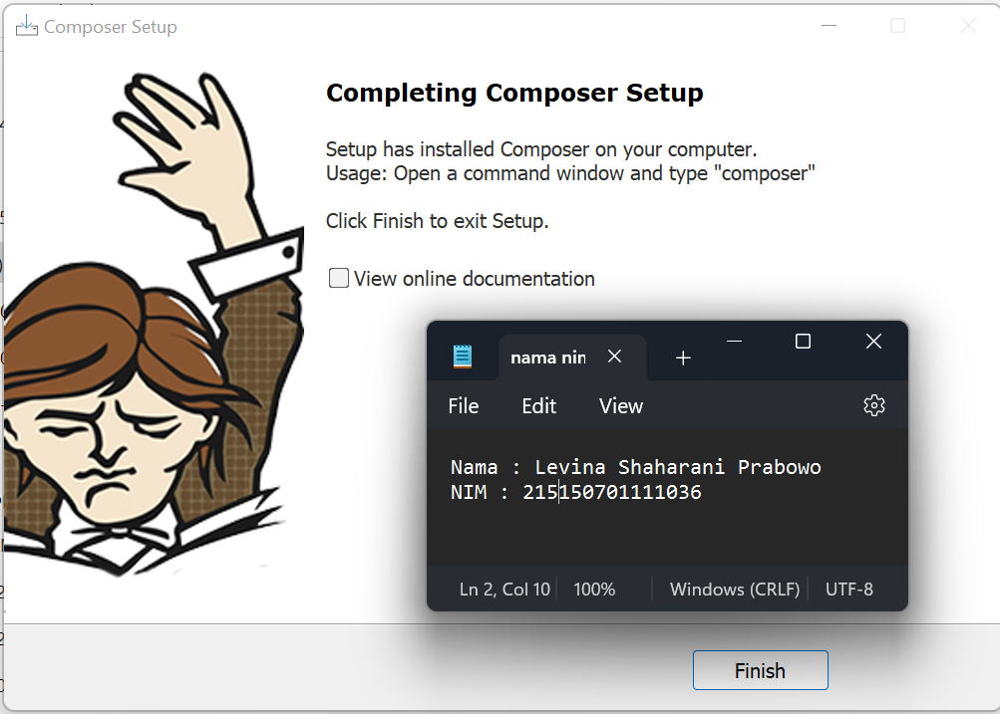
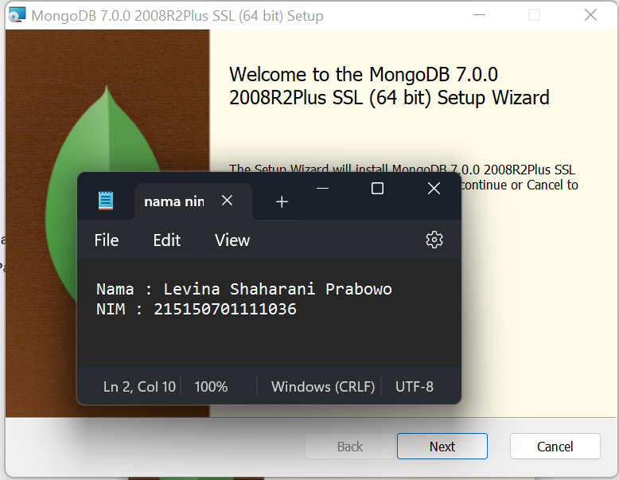
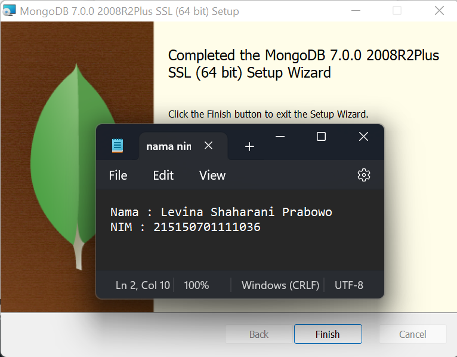
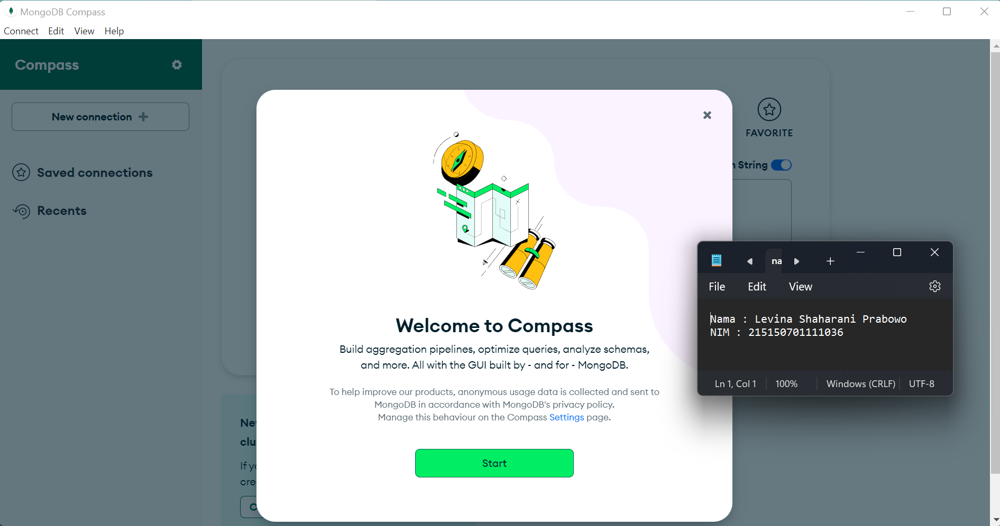

# Praktikum 1 : Instalasi Lumen, MongoDB, dan Konfirgurasi App Key

Langkah - langkah dan hasil Screenshot praktikum instalasi Lumen, MongoDB, dan konofigurasi App Key.

* ## Langkah 1 (Instalasi Composer)
> Download dan jalankan Composer-Setup.exe <br /><br />


* ## Langkah 2 (Instalasi MongoDB)
> Buka halaman https://www.mongodb.com/try/download/community dan klik Download <br /><br />
> Menjalankan mongodb-windows-x86_64-6.0.1-signed.msi

> Instalasi MongoDB telah berhasil

> Membuka MongoDB yang telah diinstal


* ## Langkah 3 (Instalasi Lumen)
> ``` git commit -m "<message>" ``` Commit data dari changes stage <br /><br />


* ## Langkah 4 (Setting App Key)
> ``` git push origin ```push dari branch local ke repository github <br /><br />


