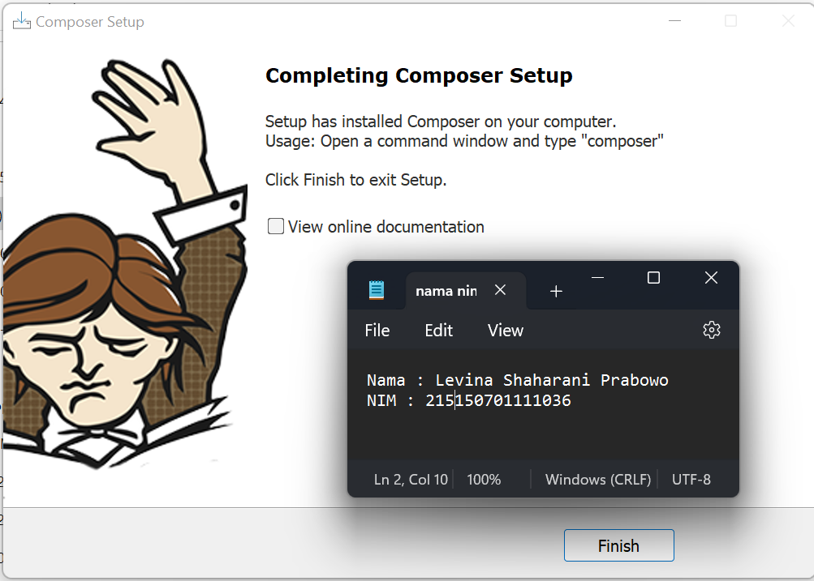
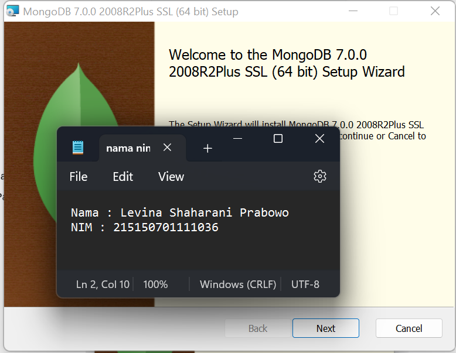
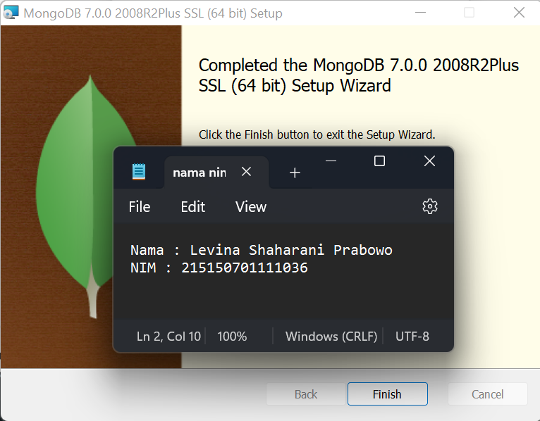
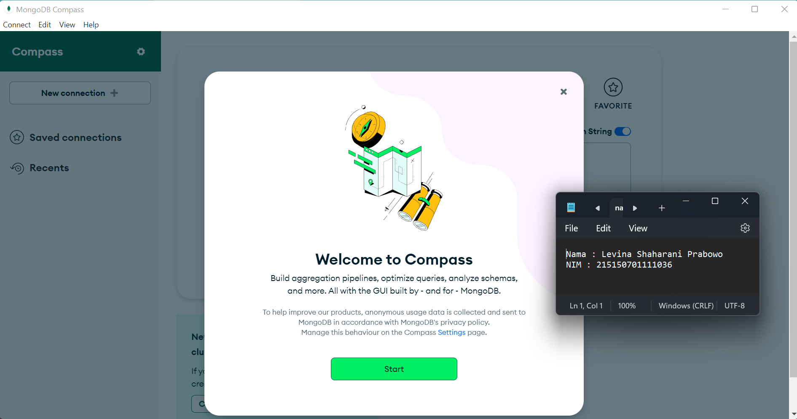
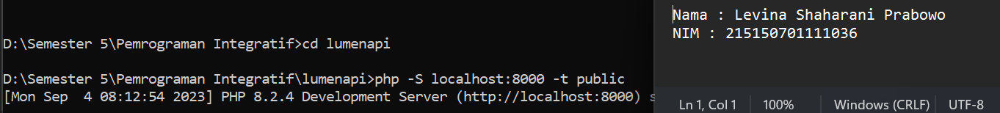
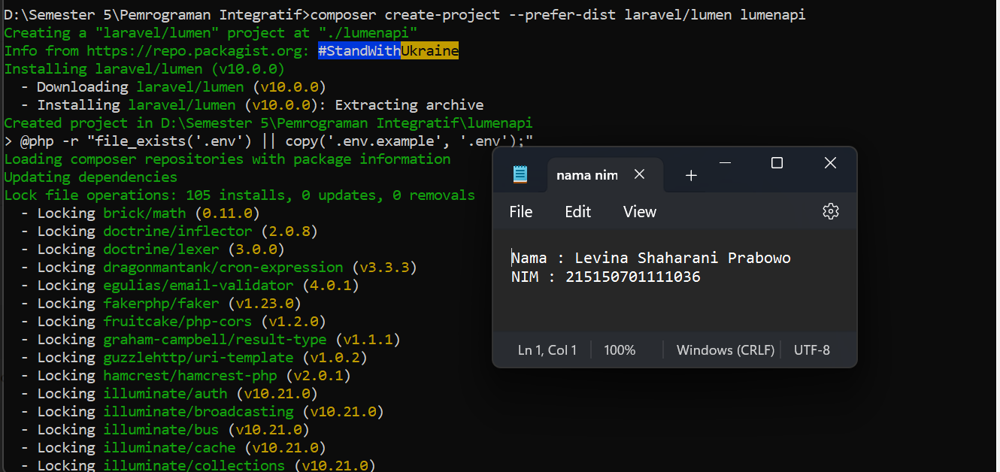
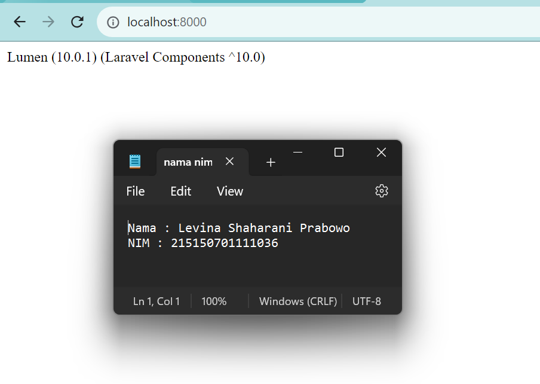
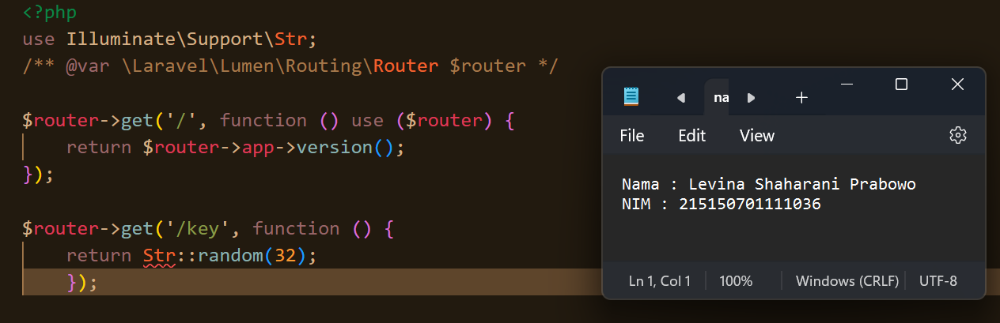
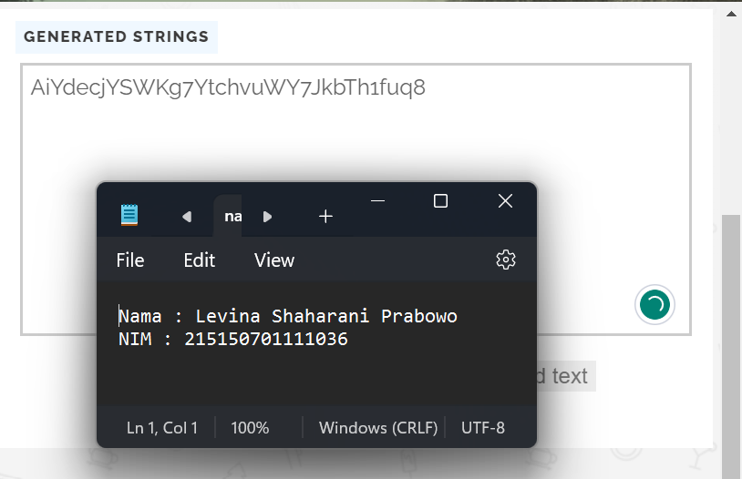
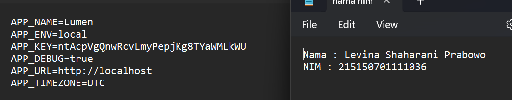

# Praktikum 1 : Instalasi Lumen, MongoDB, dan Konfirgurasi App Key

Langkah - langkah dan hasil Screenshot praktikum instalasi Lumen, MongoDB, dan konofigurasi App Key.

* ## Langkah 1 (Instalasi Composer)
> Download dan jalankan Composer-Setup.exe   

* ## Langkah 2 (Instalasi MongoDB)
> Buka halaman https://www.mongodb.com/try/download/community dan klik Download   
> Menjalankan mongodb-windows-x86_64-6.0.1-signed.msi

> Instalasi MongoDB telah berhasil

> Membuka MongoDB yang telah diinstal

* ## Langkah 3 (Instalasi Lumen)
> Buka cmd dan masuk ke path folder yang telah dibuat untuk instalasi lumen

> Instalasi lumen di cmd dengan command composer create-project --prefer-dist laravel/lumen lumenapi

> Menjalankan projek lumen

* ## Langkah 4 (Konfigurasi App Key)
> Membuka file web.php pada folder routes, kemudian buat endpoint yang akan mengembalikan random string dengan
panjang 32

> Melakukan generate dari website https://pinetools.com/random-string-generator

> Memasukkan random string tersebut ke file .env kita pada bagian
APP_KEY

