# Praktikum 3 : Integrasi MongoDB dan Express

Langkah Percobaan
## Percobaan instalasi NodeJS
* ### Langkah 1 
> Membuka Halaman https://nodejs.org/en/   

* ### Langkah 2 
> Mengunduh dan menjalankan node setup   

* ### Langkah 3 
> Setelah instalasi selesai, menjalankan command node -v untuk memeriksa apakah
NodeJS sudah terinstall

## Inisiasi project Express dan pemasangan package
* ### Langkah 1 
> Membuat folder dengan nama express-mongodb dan masuk ke dalam
folder tersebut lalu buka melalui text editor masing-masing

* ### Langkah 2
> Melakukan npm init untuk mengenerate file package.json dengan menggunakan
command npm init -y

* ### Langkah 3
> Melakukan instalasi express, mongoose, dan dotenv dengan menggunakan command
npm i express mongoose dotenv

## Koneksi Express ke MongoDB
* ### Langkah 1
> Membuat file index.js pada root folder dan masukkan kode di bawah ini

* ### Langkah 2
> MeLakukan pembuatan file .env dan masukkan baris berikut
> PORT=5000
> Setelah itu ubahlah kode pada listening port menjadi berikut dan coba jalankan aplikasi
kembali
> const PORT = process.env.PORT || 8000;
app.listen(PORT, () => {
console.log(`Running on port ${PORT}`);
})

* ### Langkah 3
> Copy connection string yang terdapat pada compas atau atlas dan paste kan pada
.env seperti berikut
MONGO_URI=<Connection string masing-masing>

* ### Langkah 4
> Tambahkan baris kode berikut pada file index.js
require('dotenv').config();
const express = require('express');
const mongoose = require('mongoose');
mongoose.connect(process.env.MONGO_URI);
const db = mongoose.connection;
db.on('error', (error) => {
console.log(error);
});
db.once('connected', () => {
console.log('Mongo connected');
})
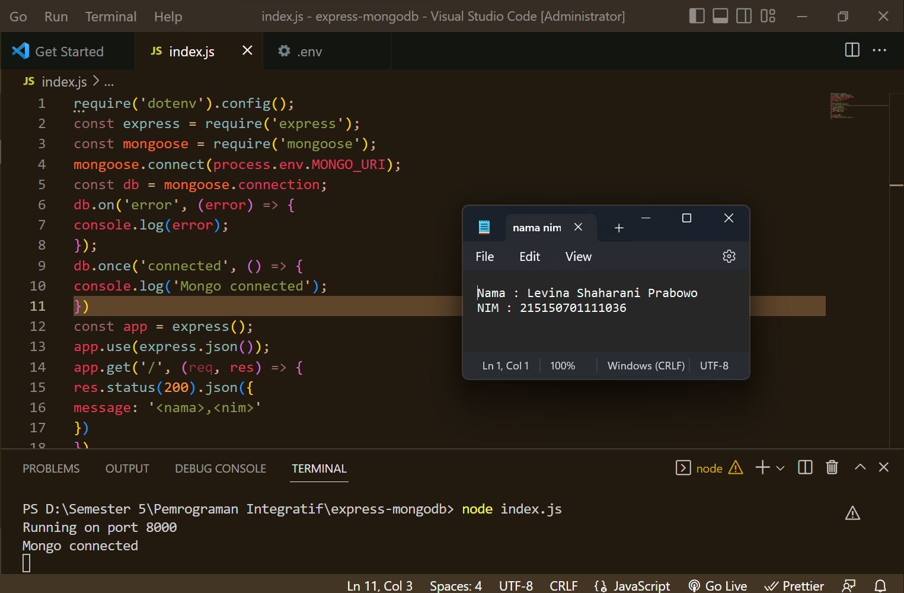

## Pembuatan Routing
* ### Langkah 1
> Lakukan pembuatan direktori routes di tingkat yang sama dengan index.js
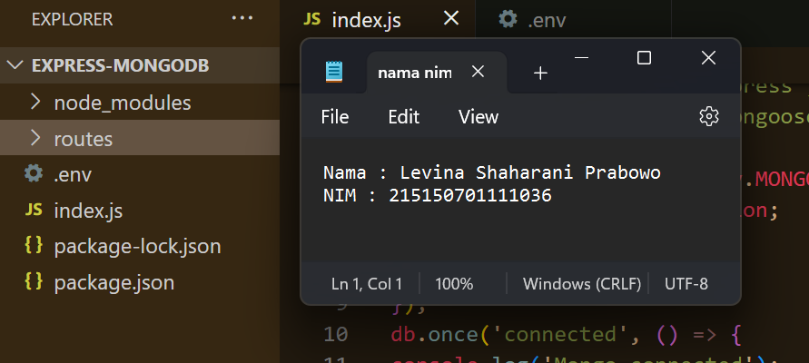

* ### Langkah 2
> Buatlah file book.route.js di dalamnya
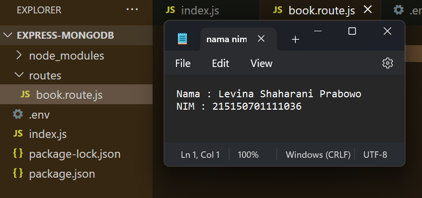

* ### Langkah 3
> Tambahkan baris kode berikut untuk fungsi getAllBooks
const router = require('express').Router();
router.get('/', function getAllBooks(req, res) {
res.status(200).json({
message: 'mendapatkan semua buku'
})
})
module.exports = router;
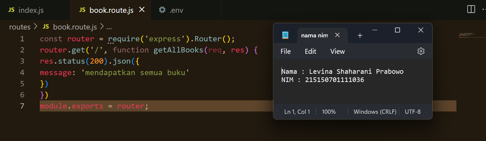

* ### Langkah 4
> Lakukan hal yang sama untuk getOneBook, createBook, updateBook, dan
deleteBook
const router = require('express').Router();
...
router.get('/:id', function getOneBook(req, res) {
const id = req.params.id;
res.status(200).json({
message: 'mendapatkan satu buku',
id,
})
})
router.post('/', function createBook(req, res) {
res.status(200).json({
message: 'membuat buku baru'
})
})
router.put('/:id', function updateBook(req, res) {
const id = req.params.id;
res.status(200).json({
message: 'memperbaharui satu buku',
id,
})
})
router.delete('/:id', function deleteBook(req, res) {
const id = req.params.id;
res.status(200).json({
message: 'menghapus satu buku',
id,
})
})
module.exports = router;
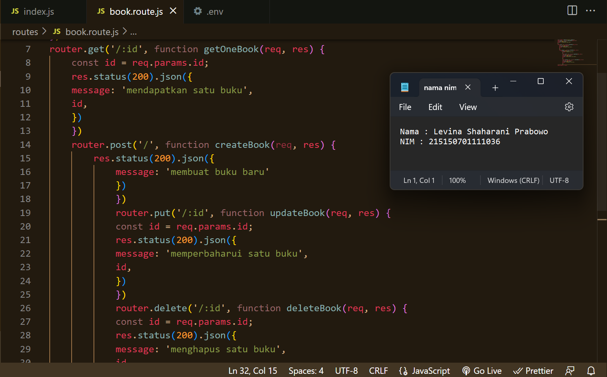

* ### Langkah 5
> Lakukan import book.route.js pada file index.js dan tambahkan baris kode berikut
require('dotenv').config();
const express = require('express');
const mongoose = require('mongoose');
const bookRoutes = require('./routes/book.route'); //
...
app.get('/', (req, res) => {
res.status(200).json({
message: '<nama>,<nim>'
})
})
app.use('/books', bookRoutes); //
const PORT = process.env.PORT || 8000;
app.listen(PORT, () => {
console.log(`Running on port ${PORT}`);
})
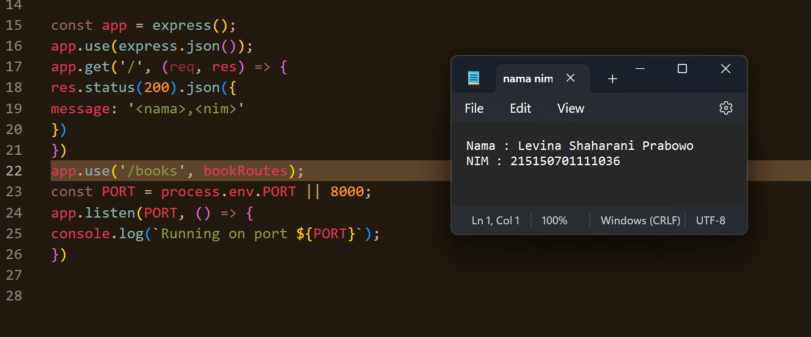

* ### Langkah 6
> Uji salah satu endpoint dengan Postman
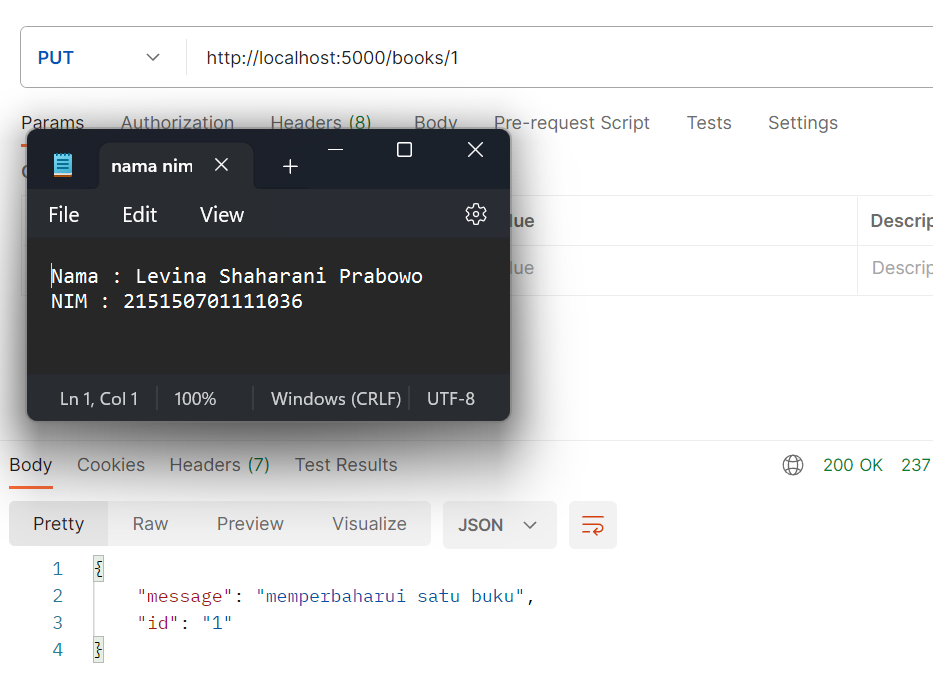

## Pembuatan Controller
* ### Langkah 1
> Lakukan pembuatan direktori controllers di tingkat yang sama dengan index.js
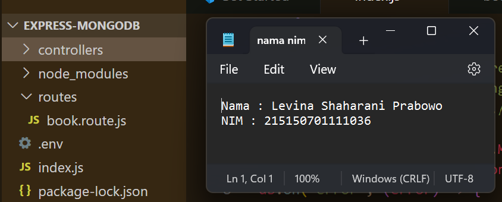

* ### Langkah 2
> Buatlah file book.controller.js di dalamnya
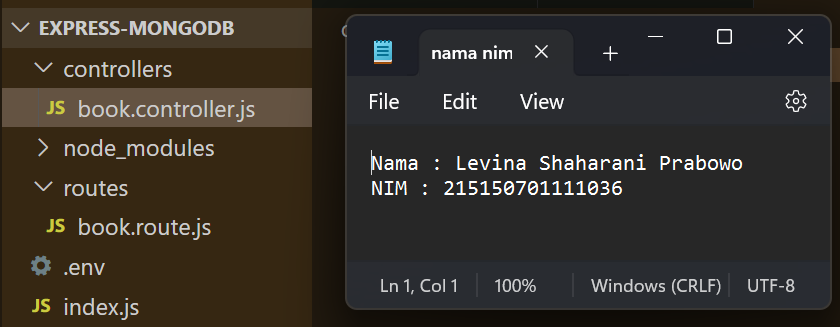

* ### Langkah 3
> Salin baris kode dari routes untuk fungsi getAllBooks
function getAllBooks(req, res) {
res.status(200).json({
message: 'mendapatkan semua buku'
})
};
module.exports = {
getAllBooks,
}
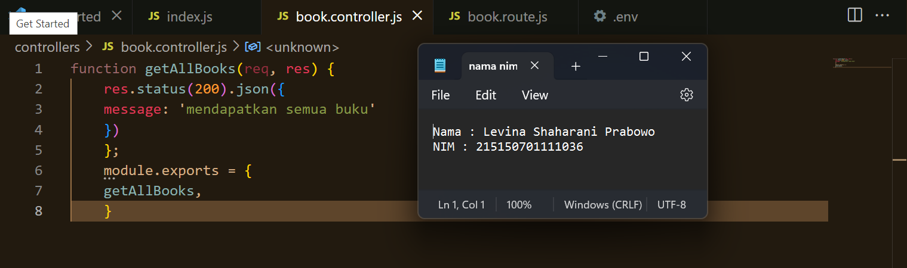

* ### Langkah 4
> Lakukan hal yang sama untuk getOneBook, createBook, updateBook, dan
deleteBook
Integrasi MongoDB dan Express 9
...
function getOneBook(req, res) {
const id = req.params.id;
res.status(200).json({
message: 'mendapatkan satu buku',
id,
})
}
function createBook(req, res) {
res.status(200).json({
message: 'membuat buku baru'
})
}
function updateBook(req, res) {
const id = req.params.id;
res.status(200).json({
message: 'memperbaharui satu buku',
id,
})
}
function deleteBook(req, res) {
const id = req.params.id;
res.status(200).json({
message: 'menghapus satu buku',
id,
})
}
module.exports = {
getAllBooks,
getOneBook, //
createBook, //
updateBook, //
deleteBook //
}
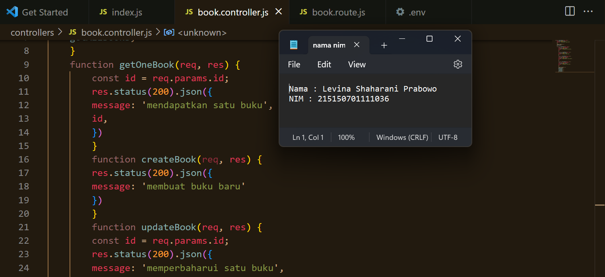

* ### Langkah 5
> Lakukan import book.controller.js pada file book.route.js
const router = require('express').Router();
const book = require('../controllers/book.controller'); //
...
module.exports = router;
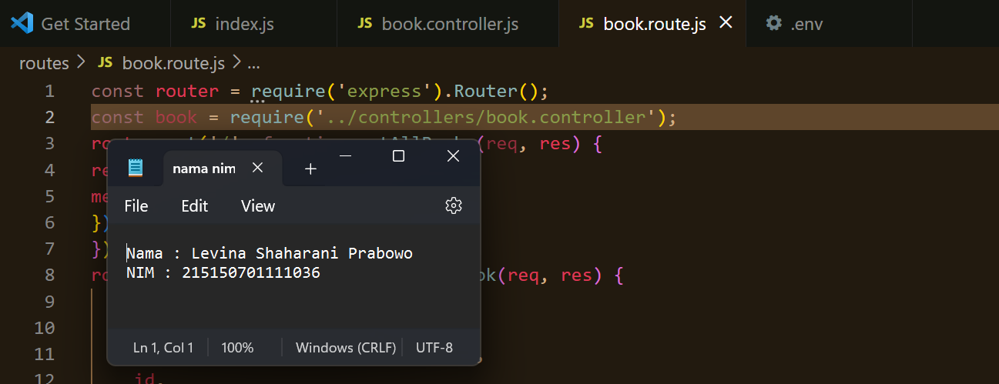

* ### Langkah 6
> Lakukan perubahan pada fungsi agar dapat memanggil fungsi dari book.controller.js
const router = require('express').Router();
const book = require('../controllers/book.controller');
router.get('/', book.getAllBooks);
router.get('/:id', book.getOneBook);
router.post('/', book.createBook);
router.put('/:id', book.updateBook);
router.delete('/:id', book.deleteBook);
module.exports = router;
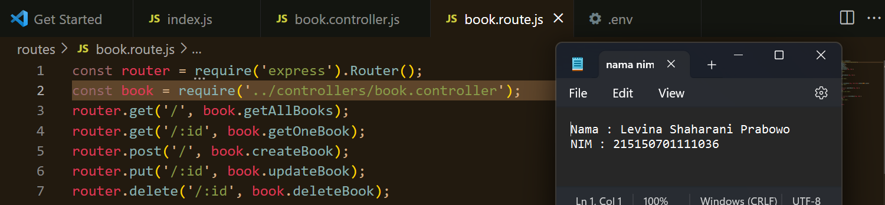

## Pembuatan Model
* ### Langkah 1
> Lakukan pembuatan direktori models di tingkat yang sama dengan index.js
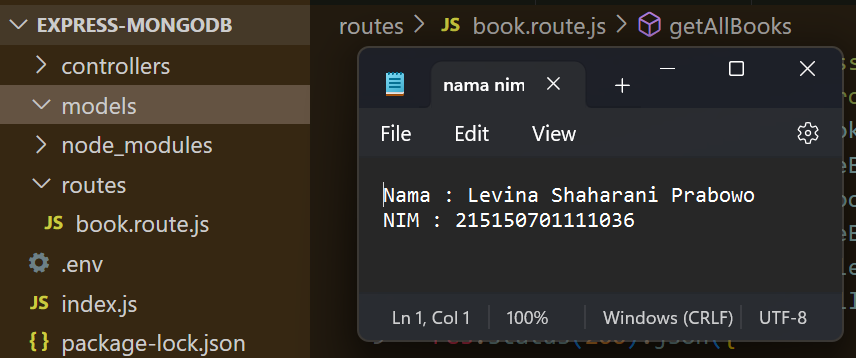

* ### Langkah 2
> Buatlah file book.model.js di dalamnya
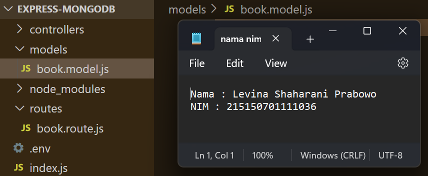

* ### Langkah 3
> Tambahkan baris kode berikut sesuai dengan tabel di atas
const mongoose = require('mongoose');
const bookSchema = new mongoose.Schema({
title: {
type: String
},
author: {
type: String
},
year: {
type: Number
},
pages: {
type: Number
},
summary: {
type: String
},
publisher: {
type: String
}
})
module.exports = mongoose.model('book', bookSchema);
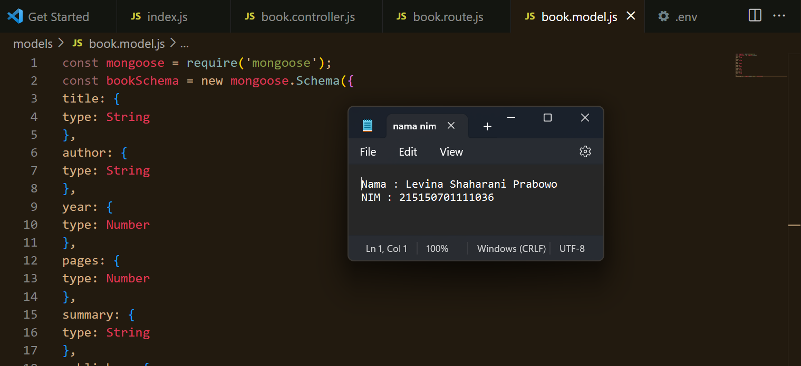

## Operasi CRUD
* ### Langkah 1
> Hapus semua data pada collection books
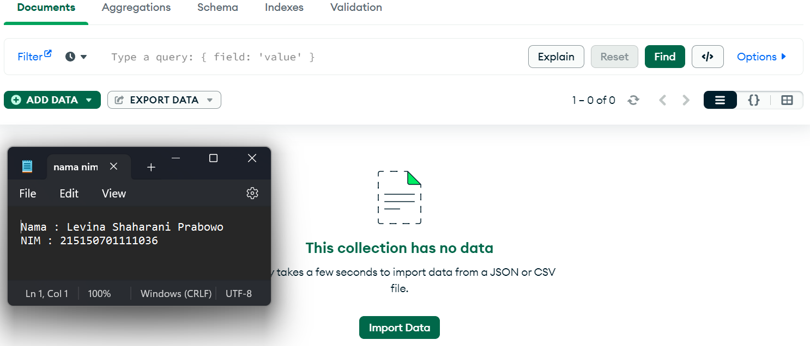

* ### Langkah 2
> Lakukan import book.model.js pada file book.controller.js
const Book = require('../models/book.model');
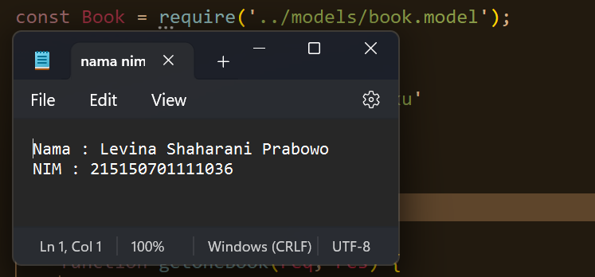

* ### Langkah 3
> Lakukan perubahan pada fungsi createBook
const Book = require('../models/book.model');
...
async function createBook(req, res) {
const book = new Book({
title: req.body.title,
author: req.body.author,
year: req.body.year,
pages: req.body.pages,
summary: req.body.summary,
publisher: req.body.publisher,
})
try {
const savedBook = await book.save();
res.status(200).json({
message: 'membuat buku baru',
book: savedBook,
})
} catch (error) {
res.status(500).json({
message: 'kesalahan pada server',
error: error.message,
})
}
}
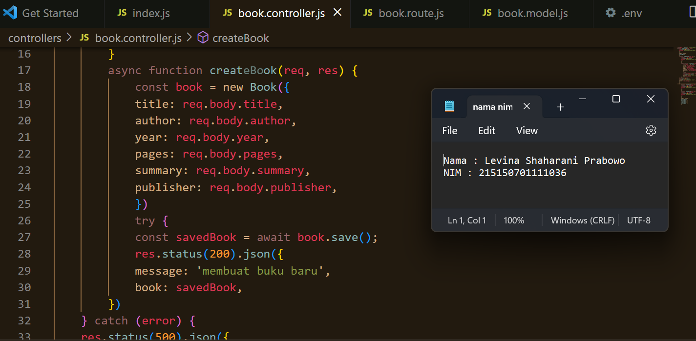

* ### Langkah 4
> Buatlah dua buah buku dengan data di bawah ini dengan Postman
{
"title": "Dilan 1990",
"author": "Pidi Baiq",
"year": 2014,
"pages": 332,
"summary": "Mirea, anata wa utsukushī",
"publisher": "Pastel Books"
}

{
"title": "Dilan 1991",
"author": "Pidi Baiq",
"year": 2015,
"pages": 344,
"summary": "Watashi ga kare o aishite iru to ittara",
"publisher": "Pastel Books"
}
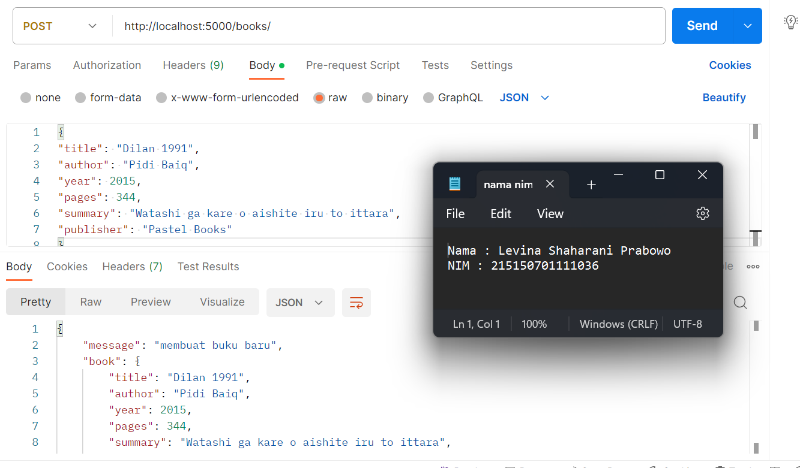

* ### Langkah 5
> Lakukan perubahan pada fungsi getAllBooks
const Book = require('../models/book.model');
async function getAllBooks(req, res) {
try {
const books = await Book.find();
res.status(200).json({
message: 'mendapatkan semua buku',
books,
})
} catch (error) {
res.status(500).json({
message: 'kesalahan pada server',
error: error.message,
})
}
}
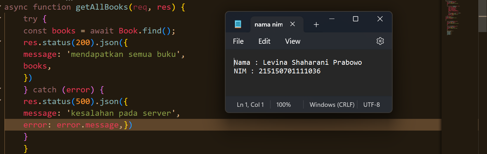

* ### Langkah 6
> Lakukan perubahan pada fungsi getOneBook
const Book = require('../models/book.model');
...
async function getOneBook(req, res) {
const id = req.params.id;
try {
const book = await Book.findById(id);
res.status(200).json({
message: 'mendapatkan satu buku',
book,
})
} catch (error) {
res.status(500).json({
message: 'kesalahan pada server',
error: error.message,
})
}
}
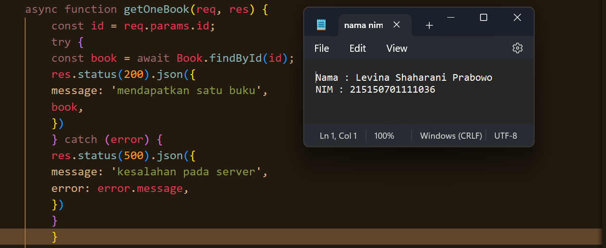

* ### Langkah 7
> Tampilkan semua buku dengan Postman
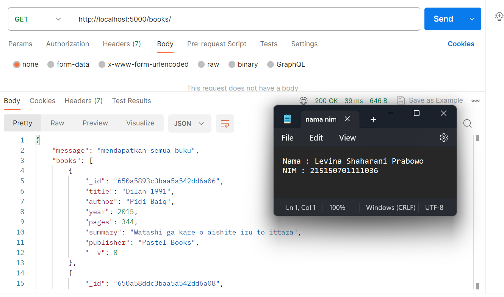

* ### Langkah 8
> Tampilkan buku Dilan 1990 dengan Postman
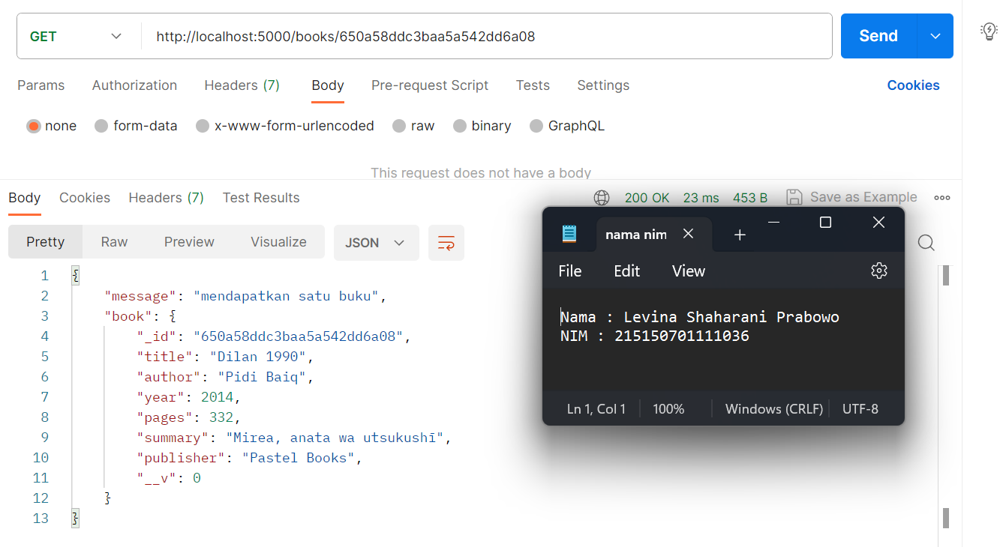

* ### Langkah 9
> Lakukan perubahan pada fungsi updateBook
> const Book = require('../models/book.model');
...
async function updateBook(req, res) {
const id = req.params.id;
try {
const book = await Book.findByIdAndUpdate(
id, req.body, { new: true }
)
res.status(200).json({
message: 'memperbaharui satu buku',
book,
})
} catch (error) {
res.status(500).json({
message: 'kesalahan pada server',
error: error.message,
})
}
}
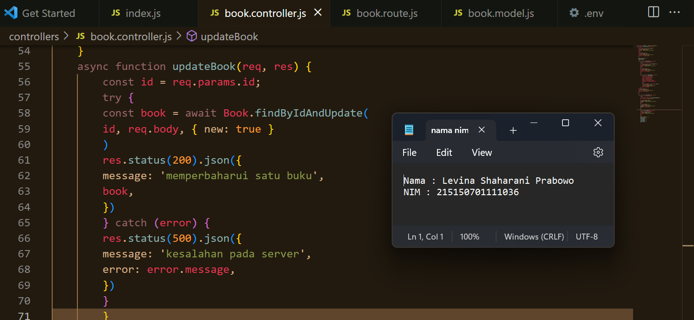

* ### Langkah 10
> Ubah judul buku Dilan 1991 menjadi “<NAMA PANGGILAN> 1991” dengan
Postman
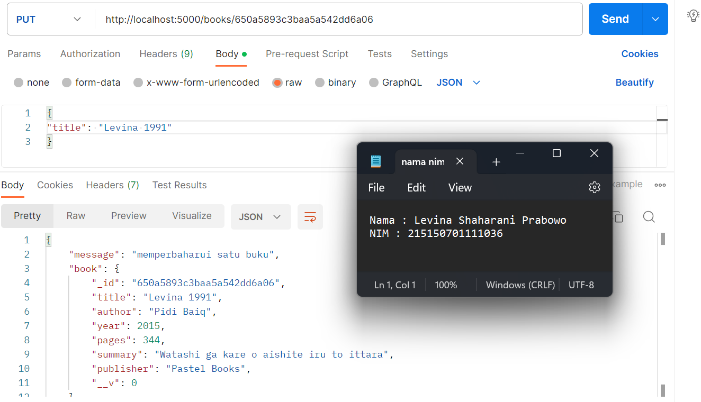

* ### Langkah 11
> Lakukan perubahan pada fungsi deleteBook
> const Book = require('../models/book.model');
...
async function deleteBook(req, res) {
const id = req.params.id;
try {
const book = await Book.findByIdAndDelete(id);
res.status(200).json({
message: 'menghapus satu buku',
book,
})
} catch (error) {
res.status(500).json({
message: 'kesalahan pada server',
error: error.message,
})
}
}
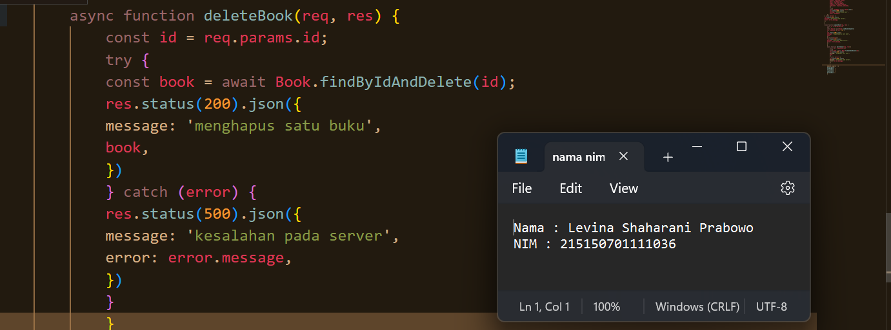

* ### Langkah 11
> Hapus buku Dilan 1990 dengan Postman
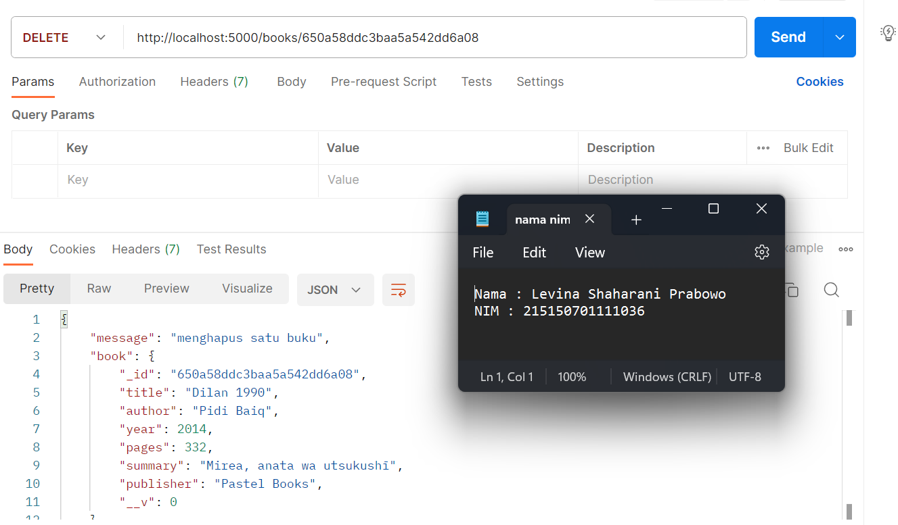
