# Praktikum 3 : Integrasi MongoDB dan Express

Langkah Percobaan
## Percobaan instalasi NodeJS
* ### Langkah 1 
> Buka Halaman https://nodejs.org/en/   
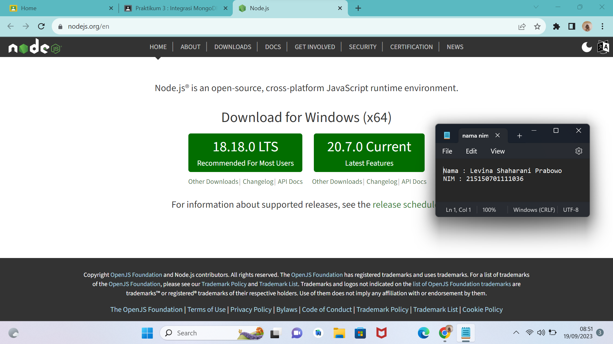

* ### Langkah 2 
> Download dan jalankan node setup   

* ### Langkah 3 
> Setelah instalasi selesai jalankan command node -v untuk memeriksa apakah
NodeJS sudah terinstall
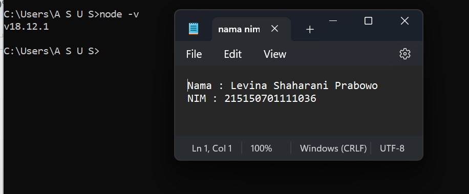

## Inisiasi project Express dan pemasangan package
* ### Langkah 1 
> Lakukan pembuatan folder dengan nama express-mongodb dan masuk ke dalam
folder tersebut lalu buka melalui text editor masing-masing
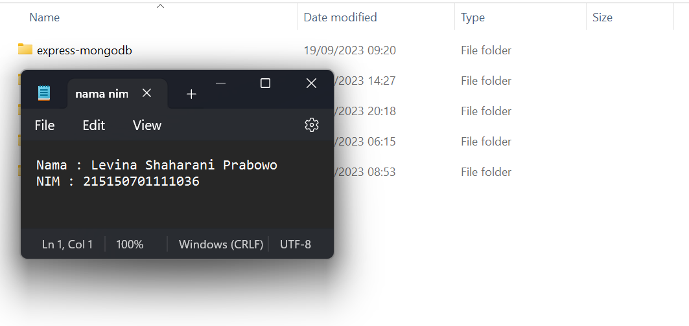

* ### Langkah 2
> Lakukan npm init untuk mengenerate file package.json dengan menggunakan
command npm init -y
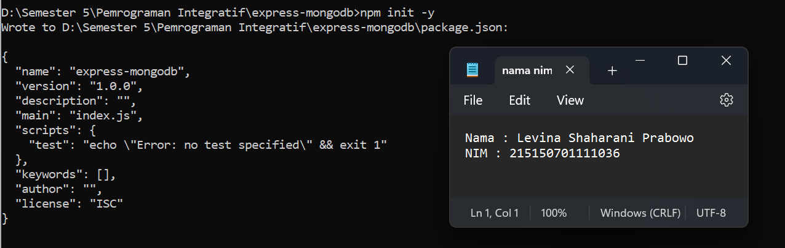

* ### Langkah 3
> Lakukan instalasi express, mongoose, dan dotenv dengan menggunakan command
npm i express mongoose dotenv
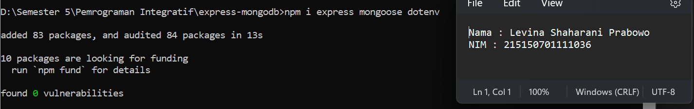

## Koneksi Express ke MongoDB
* ### Langkah 1
> Buatlah file index.js pada root folder dan masukkan kode di bawah ini
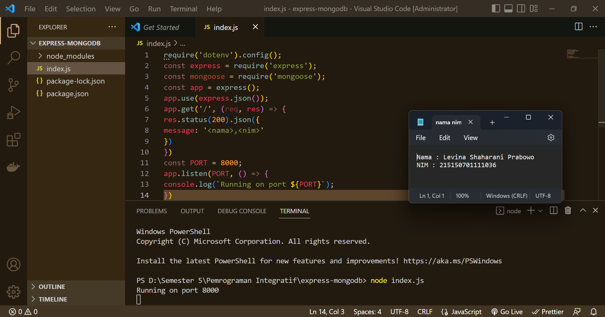

* ### Langkah 2
> Lakukan pembuatan file .env dan masukkan baris berikut PORT=5000
> Setelah itu ubahlah kode pada listening port menjadi berikut dan coba jalankan aplikasi
kembali
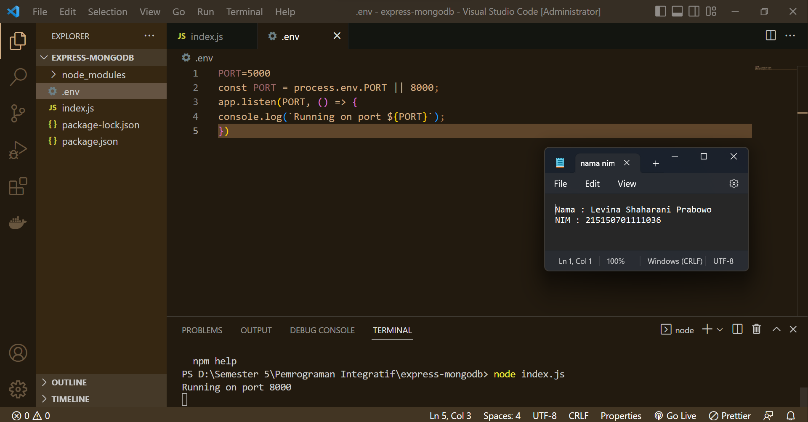

* ### Langkah 3
> Copy connection string yang terdapat pada compas atau atlas dan paste kan pada
.env seperti berikut
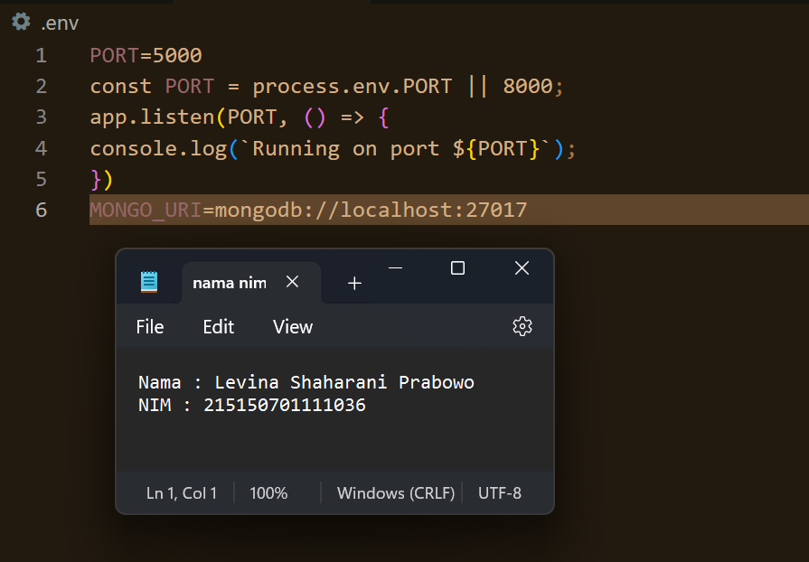

* ## Langkah 3
> Melakukan insert buku “Overlord I” dengan menggunakan command
db.books.insertOne(<data kalian>) , setelah insert buku berhasil maka MongoDB akan
mengembalikan pesan sebagai berikut.
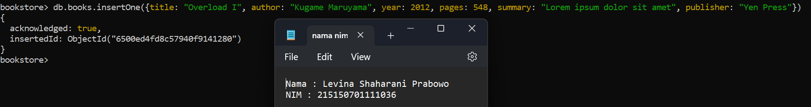

* ## Langkah 4
> Melakukan insert buku “The Setting Sun” dan “Hujan” dengan insert many dengan
menggunakan command db.books.insertMany(<data kalian>) , dan akan mengembalikan pesan sebagai berikut.
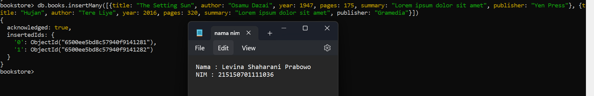

* ## Langkah 5
> Melakukan pencarian buku dengan menggunakan command db.books.find() untuk
melakukan pencarian semua buku.
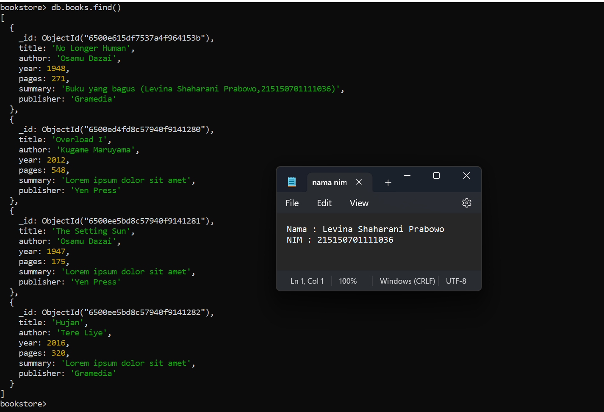

* ## Langkah 6
> Menampilkan seluruh buku dengan author “Osamu Dazai” dengan mengisi argument
pada find() dengan menggunakan command db.books.find({<filter yang ingin
diisi>})
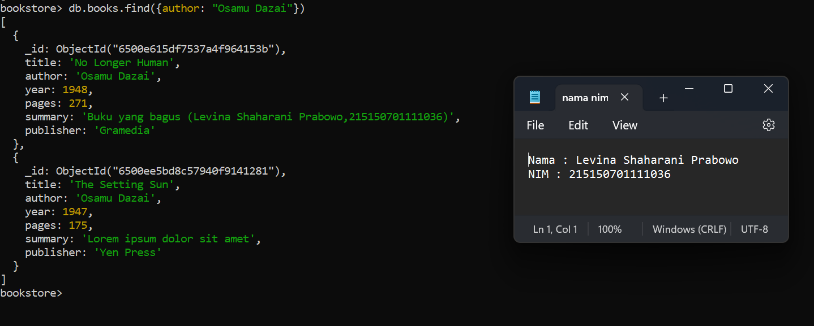

* ## Langkah 7
> Melakukan perubahan summary pada buku “Hujan” menjadi “Buku yang bagus
(<NAMA>,<NIM>) dengan mengunakan command db.books.updateOne({<filter>},
{$set: {<data yang akan di update>}}) sehingga output yang dihasilkan oleh MongoDB
akan menjadi seperti berikut

* ## Langkah 8
> Melakukan perubahan publisher menjadi “Yen Press” pada semua buku “Osamu
Dazai” dengan menggunakan command db.books.updateMany({<filter>}, {$set: {<data
yang akan di update>}})
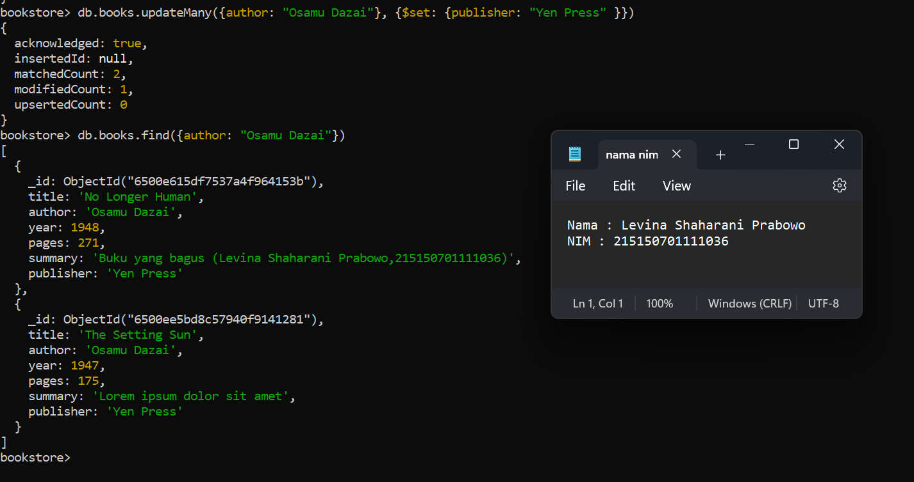

* ## Langkah 9
> Melakukan penghapusan pada buku “Overlord I” dengan menggunakan command
db.books.deleteOne({<argument>})
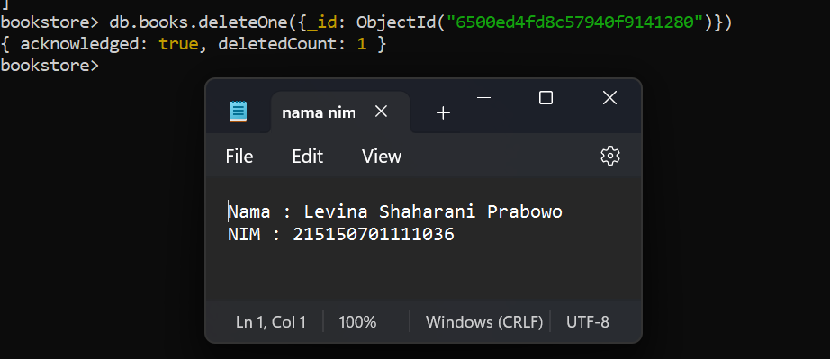

* ## Langkah 9
> Melakukan penghapusan pada semua buku “Osamu Dazai dengan menggunakan
command db.books.deleteMany({<argument>})
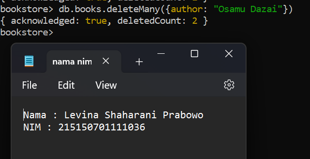

