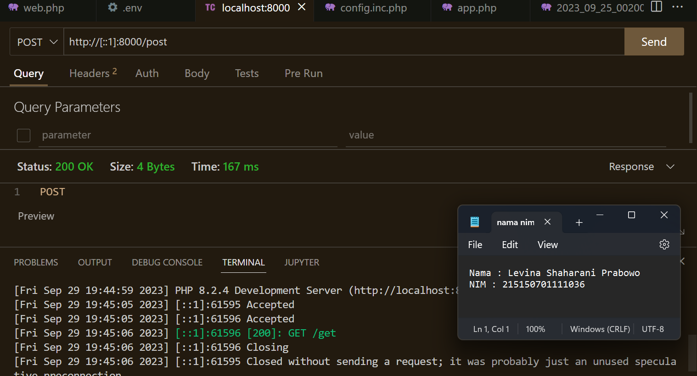

# Praktikum  4 : Basic Routing dan Migration

Langkah-langkah dan hasil Screenshot praktikum  4 – Basic Routing dan Migration.
## GET
* ## Langkah 1 
  Untuk menambahkan endpoint dengan method GET pada aplikasi kita, kita dapat
mengunjungi file web.php pada folder routes. Kemudian tambahkan baris ini pada akhir file
  $router->get('/get', function () { 
   return 'GET'; 
  });  

* ## Langkah 2 
  Setelah itu coba jalankan aplikasi dengan command,
  php -S localhost:8000 -t public   

* ## Langkah 3 
  Setelah aplikasi berhasil dijalankan, kita dapat membuka browser dengan url,
http://localhost:8000/get, path yang akan kita akses akan berbentuk demikian,
http://{BASE_URL}{PATH}, jika BASE_URL kita adalah localhost:8000 dan PATH kita
adalah /get, maka url akan berbentuk seperti diatas.

## POST, PUT, PATCH, DELETE, dan OPTIONS
* ## Langkah 1
 Sama halnya saat menambahkan method GET, kita dapat menambahkan methode POST, PUT, PATCH, DELETE, dan OPTIONS pada file web.php dengan code seperti ini
  $router->post('/post', function () {  
  return 'POST';  
  });  
  $router->put('/put', function () {  
  return 'PUT';  
  });  
  $router->patch('/patch', function () {
 return 'PATCH';  
  });  
  $router->delete('/delete', function () {
 return 'DELETE';  
  });  
  $router->options('/options', function () {
 return 'OPTIONS';  
  });  

* ## Langkah 2
 Mengakses url http://localhost:8000/get pada Thunder Client

* ## Langkah 3
 Mengakses url http://localhost:8000/post pada Thunder Client
 

* ## Langkah 4
 Mengakses url http://localhost:8000/put pada Thunder Client
 

* ## Langkah 5
  Mengakses url http://localhost:8000/patch pada Thunder Client
 

* ## Langkah 6
 Mengakses url http://localhost:8000/delete pada Thunder Client
 

## Migrasi Database
* ## Langkah 1 
 Sebelum melakukan migrasi database pastikan server database aktif kemudian pastikan sudah membuat database dengan nama lumenapi 

* ## Langkah 2 
 Kemudian ubah konfigurasi database pada file .env menjadi seperti ini   DB_CONNECTION=mysql  
  DB_HOST=127.0.0.1  
  DB_PORT=3306  
  DB_DATABASE=lumenapi  
  DB_USERNAME=root  
  DB_PASSWORD=<<password masing-masing>>  
   

* ## Langkah 3 
 Setelah mengubah konfigurasi pada file .env, kita juga perlu menghidupkan beberapa library bawaan dari lumen dengan membuka file app.php pada folder bootstrap dan mengubah baris ini,
 //$app->withFacades(); 
 //$app->withEloquent();  
  Menjadi  
  $app->withFacades();
$app->withEloquent();  

* ## Langkah 4
 Setelah itu jalankan command berikut untuk membuat file migration
  php artisan make:migration create_users_table # membuat migrasi
untuk tabel users 
 php artisan make:migration create_products_table # membuat
migrasi untuk tabel products 
  Setelah menjalankan 2 syntax diatas akan terbuat 2 file pada folder database/migrations dengan format YYYY_MM_DD_HHmmss_nama_migrasi. Pada file migrasi kita akan menemukan fungsi up() dan fungsi down(), fungsi up() akan digunakan pada saat kita melakukan migrasi, fungsi down() akan digunakan saat kita ingin me-rollback migrasi  

* ## Langkah 5
 Ubah fungsi up pada file migrasi create_users_table menjadi seperti dibawah ini
 public function up() 
 { 
 Schema::create('users', function (Blueprint $table) { 
 $table->id(); 
 $table->timestamps(); 
 $table->string('email'); 
 $table->string('password'); 
 }); 
 } 

* ## Langkah 6
 Ubah fungsi up pada file migrasi create_products_table menjadi seperti dibawah ini
 public function up() 
 { 
 Schema::create('products', function (Blueprint $table) { 
 $table->id(); 
 $table->timestamps(); 
 $table->string('name'); 
 $table->integer('category_id'); 
 $table->string('slug'); 
 $table->integer('price'); 
 $table->integer('weight'); 
 a$table->text('description'); 
 }); 
 } 

* ## Langkah 6
  Kemudian jalankan command,
  php artisan migrate

* ## Langkah 7
 Tampilan tabel yang berhasil dibuat pada database lumenapi di phpmyadmin

