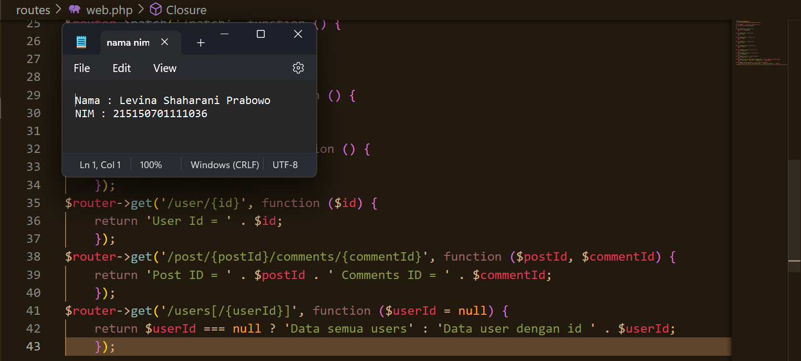

# Praktikum  5 : Dynamic Route dan Middleware

Langkah-langkah dan hasil Screenshot praktikum  4 – Basic Routing dan Migration.
* ## Langkah 1 Dynamic Route
>  Dynamic route adalah route yang dapat berubah-ubah, contohnya pada saat kita membuka
suatu halaman web, kadang kita melihat /users/1 atau /users/2 , hal ini yang dinamakan
dynamic routes.
 Untuk menambahkan dynamic routes pada aplikasi lumen kita, kita dapat menggunakan
syntax berikut,
 $router->get('/user/{id}', function ($id) {
 return 'User Id = ' . $id;
 });
 Saat menambahkan parameter pada routes, kita tidak terbatas pada 1 variable saja, namun
kita dapat menambahkan sebanyak yang diperlukan seperti kode berikut,
 $router->get('/post/{postId}/comments/{commentId}', function ($postId, $commentId) {
 return 'Post ID = ' . $postId . ' Comments ID = ' . $commentId;
 });
 Pada dynamic routes kita juga bisa menambahkan optional routes, yang mana optional
routes tidak mengharuskan kita untuk memberi variable pada endpoint kita, namun saat kita
memanggil endpoint, dapat menggunakan parameter variable ataupun tidak, seperti pada
kode dibawah ini
 $router->get('/users[/{userId}]', function ($userId = null) {
 return $userId === null ? 'Data semua users' : 'Data user dengan id ' . $userId;
 });

* ## Langkah 2 
> Setelah itu coba jalankan aplikasi dengan command,
> php -S localhost:8000 -t public   

* ## Langkah 3 
> Setelah aplikasi berhasil dijalankan, kita dapat membuka browser dengan url,
http://localhost:8000/get, path yang akan kita akses akan berbentuk demikian,
http://{BASE_URL}{PATH}, jika BASE_URL kita adalah localhost:8000 dan PATH kita
adalah /get, maka url akan berbentuk seperti diatas.

## POST, PUT, PATCH, DELETE, dan OPTIONS
* ## Langkah 1
>  Sama halnya saat menambahkan method GET, kita dapat menambahkan methode POST, PUT, PATCH, DELETE, dan OPTIONS pada file web.php dengan code seperti ini
>   $router->post('/post', function () {  
  return 'POST';  
  });  
  $router->put('/put', function () {  
  return 'PUT';  
  });  
  $router->patch('/patch', function () {
 return 'PATCH';  
  });  
  $router->delete('/delete', function () {
 return 'DELETE';  
  });  
  $router->options('/options', function () {
 return 'OPTIONS';  
  });  

* ## Langkah 2
> Mengakses url http://localhost:8000/get pada Postman

* ## Langkah 3
> Mengakses url http://localhost:8000/post pada Postman
 

* ## Langkah 4
> Mengakses url http://localhost:8000/put pada Postman
 

* ## Langkah 5
> Mengakses url http://localhost:8000/patch pada Postman
 

* ## Langkah 6
> Mengakses url http://localhost:8000/delete pada Postman
 

* ## Langkah 7
> Mengakses url http://localhost:8000/options pada Postman
 

## Migrasi Database
* ## Langkah 1 
>  Sebelum melakukan migrasi database pastikan server database aktif kemudian pastikan sudah membuat database dengan nama lumenapi 

* ## Langkah 2 
>  Kemudian ubah konfigurasi database pada file .env menjadi seperti ini   DB_CONNECTION=mysql  
  DB_HOST=127.0.0.1  
  DB_PORT=3306  
  DB_DATABASE=lumenapi  
  DB_USERNAME=root  
  DB_PASSWORD=<<password masing-masing>>  
   

* ## Langkah 3 
>Setelah mengubah konfigurasi pada file .env, kita juga perlu menghidupkan beberapa library bawaan dari lumen dengan membuka file app.php pada folder bootstrap dan mengubah baris ini,
>  //$app->withFacades(); 
 //$app->withEloquent();  
  Menjadi  
  $app->withFacades();
$app->withEloquent();  

* ## Langkah 4
> Setelah itu jalankan command berikut untuk membuat file migration
>   php artisan make:migration create_users_table # membuat migrasi
untuk tabel users 
 php artisan make:migration create_products_table # membuat
migrasi untuk tabel products 
  Setelah menjalankan 2 syntax diatas akan terbuat 2 file pada folder database/migrations dengan format YYYY_MM_DD_HHmmss_nama_migrasi. Pada file migrasi kita akan menemukan fungsi up() dan fungsi down(), fungsi up() akan digunakan pada saat kita melakukan migrasi, fungsi down() akan digunakan saat kita ingin me-rollback migrasi  

* ## Langkah 5
> Ubah fungsi up pada file migrasi create_users_table menjadi seperti dibawah ini
 public function up() 
 { 
 Schema::create('users', function (Blueprint $table) { 
 $table->id(); 
 $table->timestamps(); 
 $table->string('email'); 
 $table->string('password'); 
 }); 
 } 

* ## Langkah 6
> Ubah fungsi up pada file migrasi create_products_table menjadi seperti dibawah ini
 public function up() 
 { 
 Schema::create('products', function (Blueprint $table) { 
 $table->id(); 
 $table->timestamps(); 
 $table->string('name'); 
 $table->integer('category_id'); 
 $table->string('slug'); 
 $table->integer('price'); 
 $table->integer('weight'); 
 a$table->text('description'); 
 }); 
 } 

* ## Langkah 6
>  Kemudian jalankan command,
  php artisan migrate

* ## Langkah 7
> Tampilan tabel yang berhasil dibuat pada database lumenapi di phpmyadmin

