# Praktikum  6: Model, Controller dan Request-Response Handler

Langkah-langkah dan hasil Screenshot praktikum   6 : Model, Controller dan Request-Response Handler
* ## Model
Pastikan terdapat tabel users yang dibuat menggunakan migration pada bab sebelumnya.

 Bersihkan isi User.php yang ada sebelumnya dan isi dengan baris kode berikut
 <?php
 namespace App\Models;
 use Illuminate\Database\Eloquent\Model;
 class User extends Model
 {
 /**
 * The attributes that are mass assignable.
 *
 * @var array
 */
 protected $fillable = [ 'name', 'email', 'password'];
 /**
 * The attributes excluded from the model's JSON form.
 *
 * @var array
 */
 protected $hidden = [];
 }

* ## Controller
 Buatlah salinan ExampleController.php pada folder app/Http/Controllers dengan nama HomeController.php dan buatlah fungsi index()
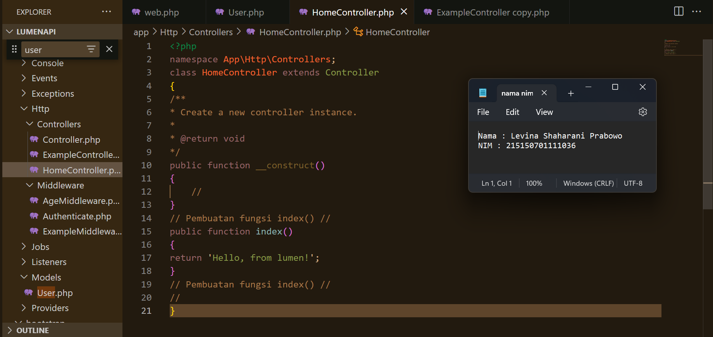

 Ubah route / pada file routes/web.php menjadi seperti ini
 $router->get('/', ['uses' => 'HomeController@index']);

 Menjalankan Aplikasi
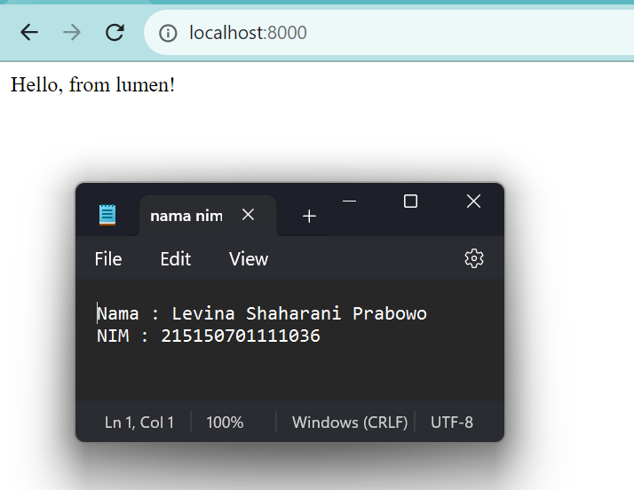

* ## Request Handler
 Lakukan import library Request dengan menambahkan baris berikut di bagian atas file
  use Illuminate\Http\Request;
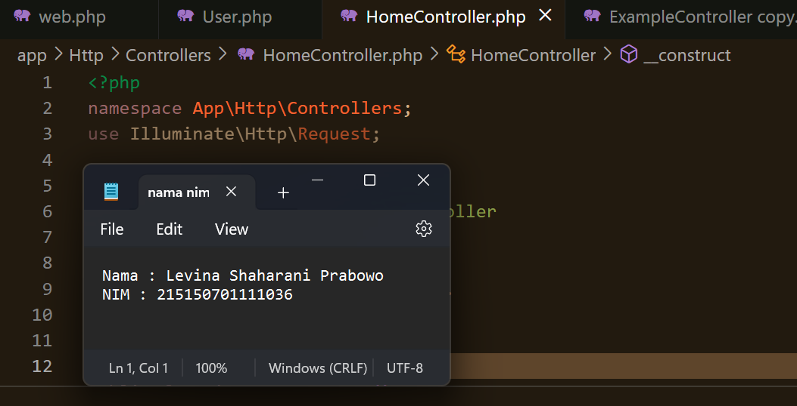

 Ubah fungsi index menjadi
 public function index (Request $request)
 {
 return 'Hello, from lumen! We got your request from endpoint: ' . $request->path();
 }
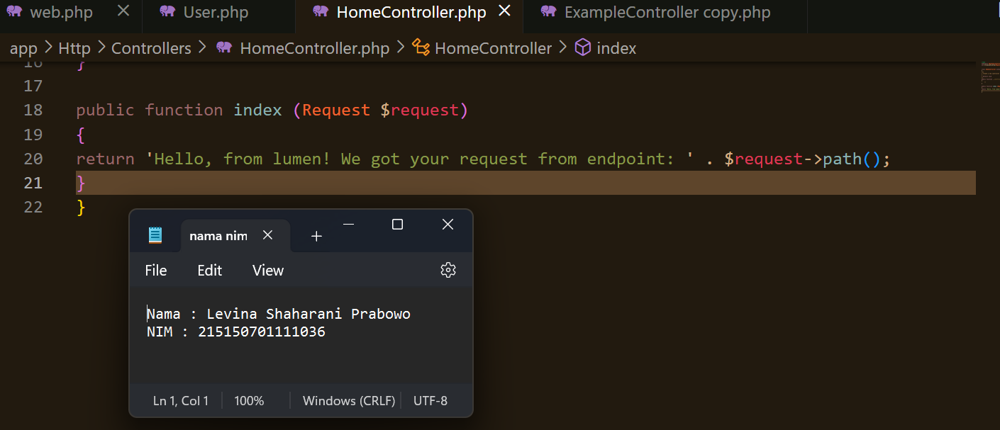

 Menjalankan Aplikasi
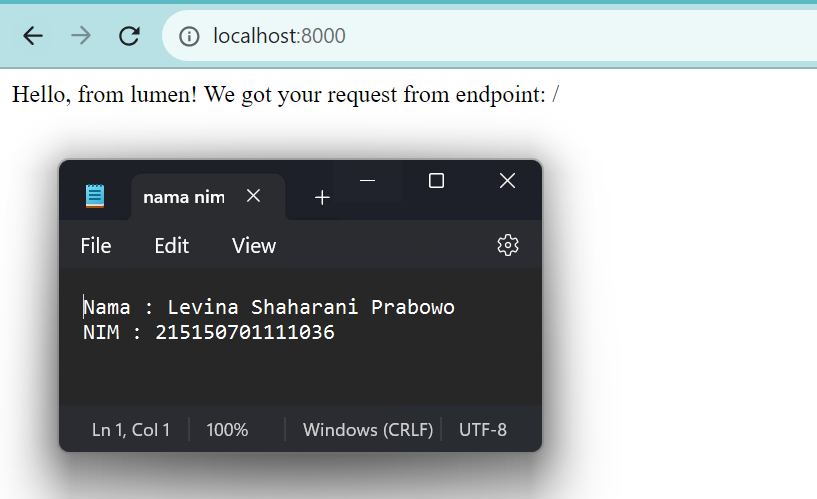

* ## Response Handler
 Lakukan import library Response dengan menambahkan baris berikut di bagian atas file
  use Illuminate\Http\Response;
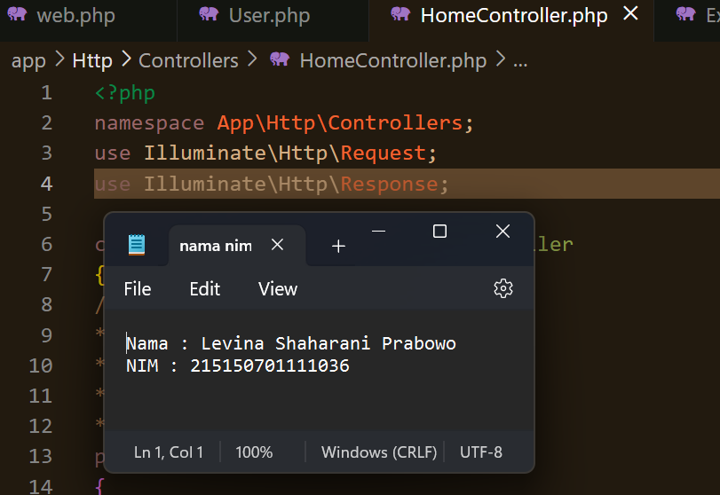

 Buatlah fungsi hello() yang berisi
 public function hello()
 {
 $data['status'] = 'Success';
 $data['message'] = 'Hello, from lumen!';
 return (new Response($data, 201))
 ->header('Content-Type', 'application/json');
 }
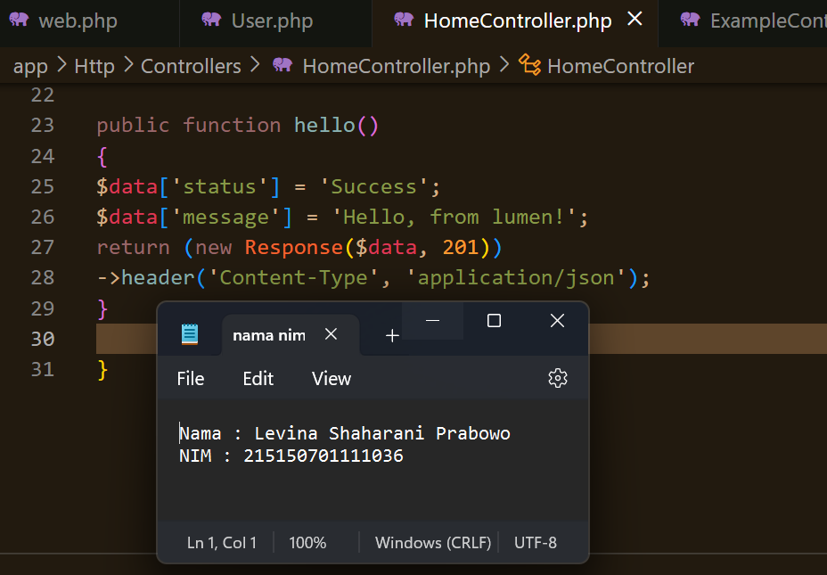

 Tambahkan route /hello pada file routes/web.php
 $router->get('/hello', ['uses' => 'HomeController@hello']);
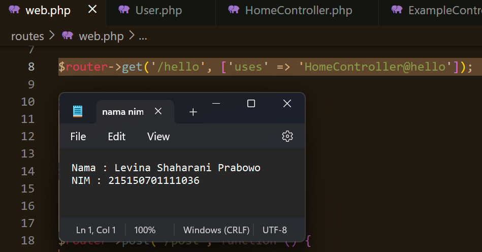

 Menjalankan aplikasi pada route /hello
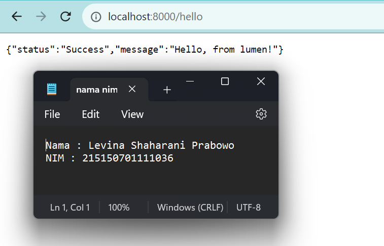

* ## Penerapan
 Lakukan import model User dengan menambahkan baris berikut di bagian atas file
 use App\Models\User;
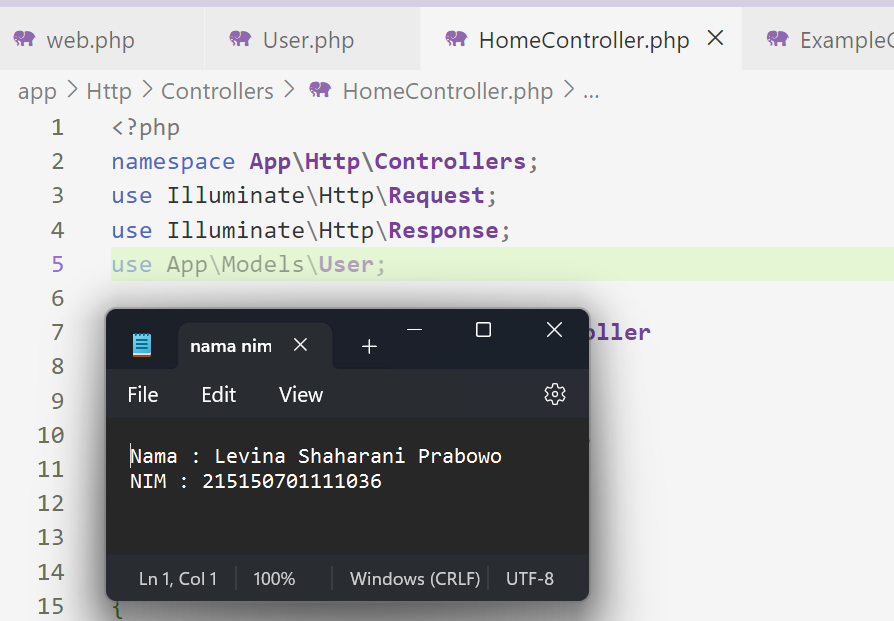

 Tambahkan ketiga fungsi berikut di HomeController.php
 public function defaultUser()
 {
 $user = User::create([
 'name' => 'Nahida',
 'email' => 'nahida@akademiya.ac.id',
 'password' => 'smol'
 ]);
 return response()->json([
 'status' => 'Success',
 'message' => 'default user created',
 'data' => [
 'user' => $user,
 ]
 ],200);
 }
 public function createUser(Request $request)
 {
 $name = $request->name;
 $email = $request->email;
 $password = $request->password;
 $user = User::create([
 'name' => $name,
 'email' => $email,
 'password' => $password
 ]);
 return response()->json([
 'status' => 'Success',
 'message' => 'new user created',
 'data' => [
 'user' => $user,
 ]
 ],200);
 }
 public function getUsers()
 {
 $users = User::all();
 return response()->json([
 'status' => 'Success',
 'message' => 'all users grabbed',
 'data' => [
 'users' => $users,
 ]
 ],200);
 }
 // Tiga Fungsi
 }
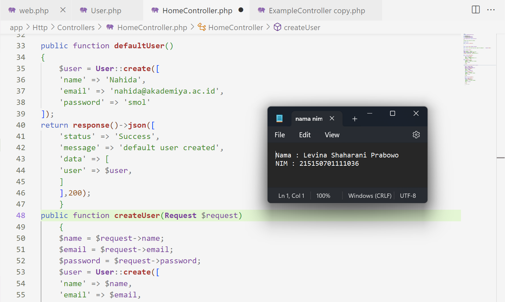

 Tambahkan ketiga route pada file routes/web.php menggunakan group route
 $router->group(['prefix' => 'users'], function () use ($router) {
 $router->post('/default', ['uses' => 'HomeController@defaultUser']);
 $router->post('/new', ['uses' => 'HomeController@createUser']);
 $router->get('/all', ['uses' => 'HomeController@getUsers']);
 });
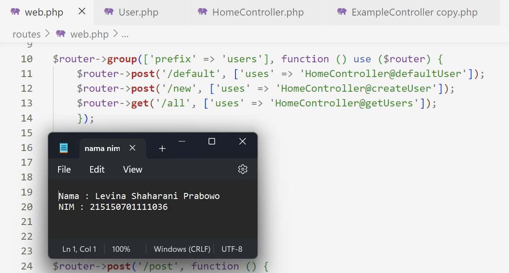

 Jalankan aplikasi pada route /users/default menggunakan Postman
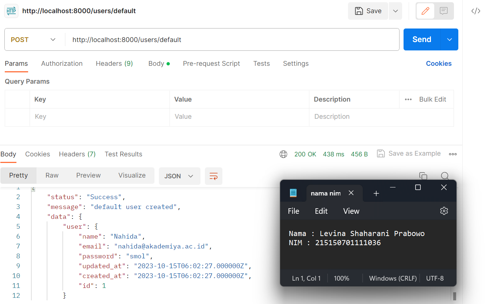

 Jalankan aplikasi pada route /users/new dengan mengisi body
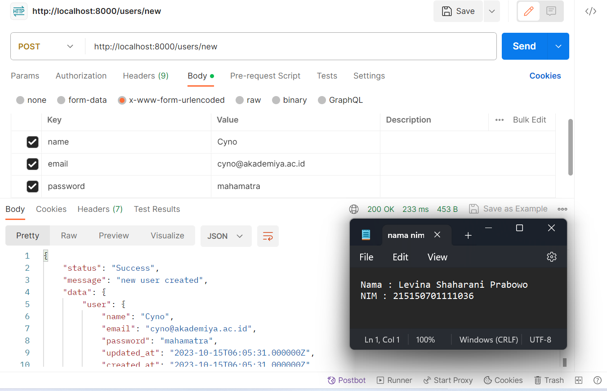

 Jalankan aplikasi pada route /users/all
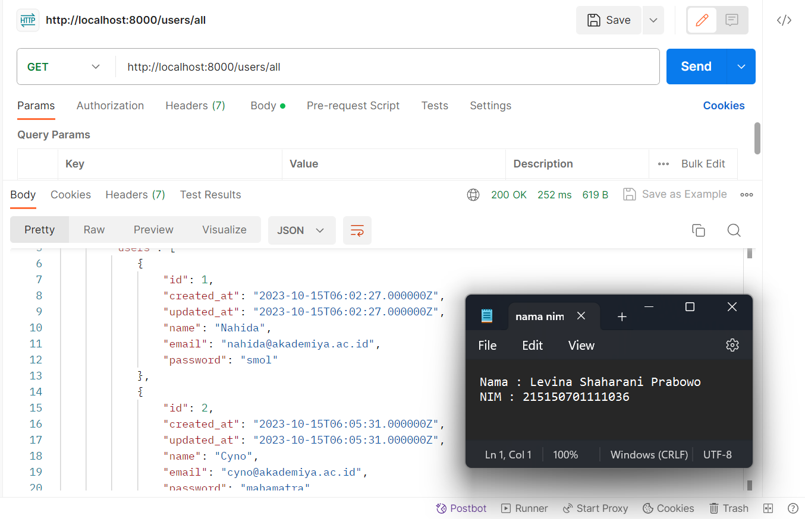
