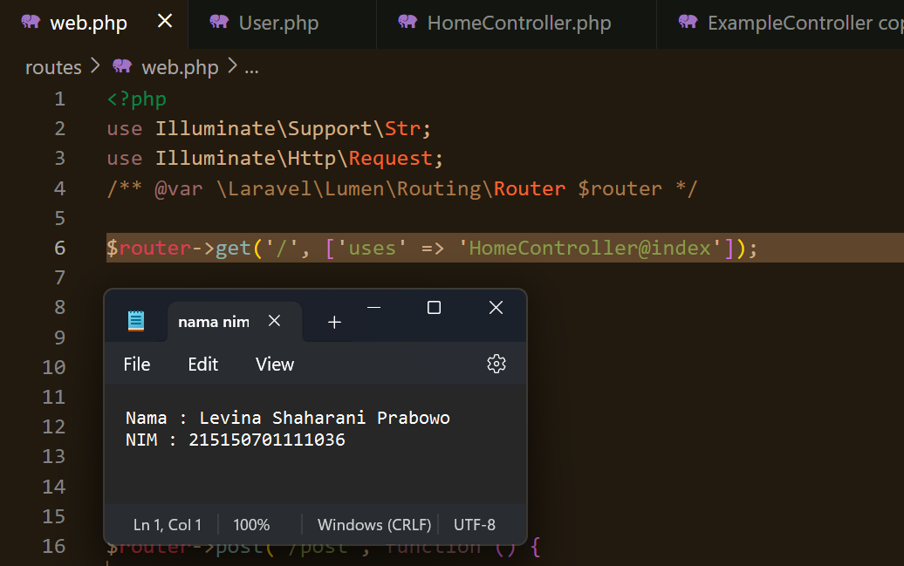

# Praktikum  6: Model, Controller dan Request-Response Handler

Langkah-langkah dan hasil Screenshot praktikum   6 : Model, Controller dan Request-Response Handler
* ## Model
>  Pastikan terdapat tabel users yang dibuat menggunakan migration pada bab sebelumnya.

>  Bersihkan isi User.php yang ada sebelumnya dan isi dengan baris kode berikut
 <?php
 namespace App\Models;
 use Illuminate\Database\Eloquent\Model;
 class User extends Model
 {
 /**
 * The attributes that are mass assignable.
 *
 * @var array
 */
 protected $fillable = [ 'name', 'email', 'password'];
 /**
 * The attributes excluded from the model's JSON form.
 *
 * @var array
 */
 protected $hidden = [];
 }

* ## Controller
>  Buatlah salinan ExampleController.php pada folder app/Http/Controllers dengan nama HomeController.php dan buatlah fungsi index()

>  Ubah route / pada file routes/web.php menjadi seperti ini
> $router->get('/', ['uses' => 'HomeController@index']);

>  Menjalankan Aplikasi

* ## Request Handler
>  Lakukan import library Request dengan menambahkan baris berikut di bagian atas file
> use Illuminate\Http\Request;

