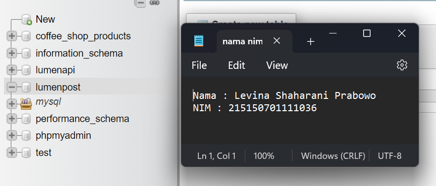
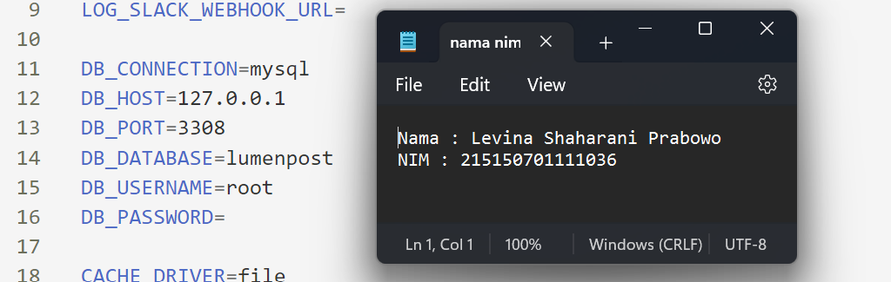
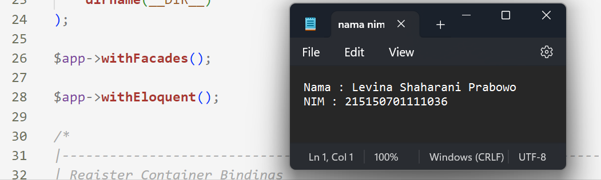
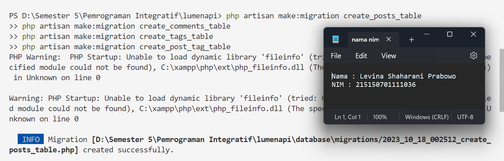
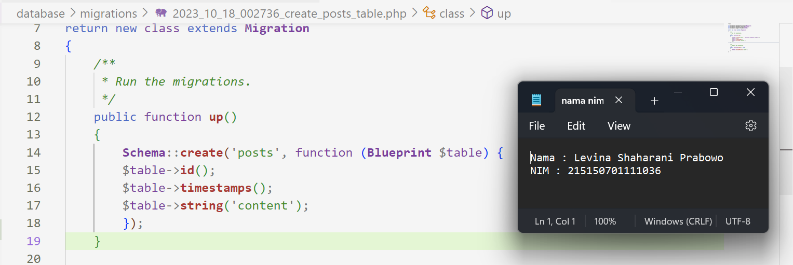

# Praktikum  7 : Relasi One-to-Many dan Many-to-Many

Langkah-langkah dan hasil Screenshot praktikum  7 : Relasi One-to-Many dan Many-to-Many
* ## Pembuatan Tabel
* ### Langkah 1
Sebelum membuat migrasi database atau membuat tabel pastikan server database aktif kemudian pastikan sudah membuat database dengan nama lumenpost

* ### Langkah 2
Kemudian ubah konfigurasi database pada file .env

* ### Langkah 3
Menghidupkan beberapa library bawaan dari lumen dengan membuka file app.php pada folder bootstrap

* ### Langkah 4
Menjalankan command berikut untuk membuat file migration

* ### Langkah 5
Mengubah fungsi up() pada file migrasi create_posts_table

