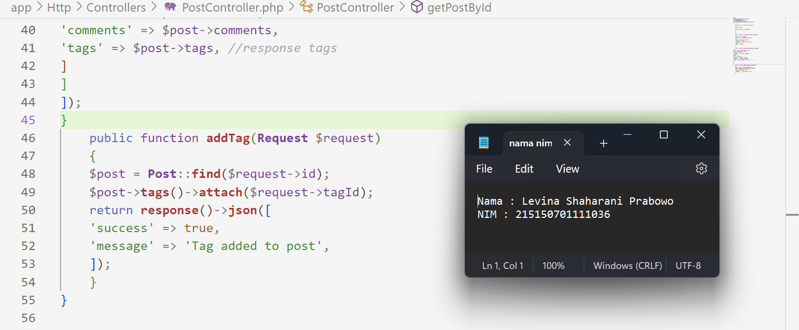

# Praktikum  7 : Relasi One-to-Many dan Many-to-Many

Langkah-langkah dan hasil Screenshot praktikum  7 : Relasi One-to-Many dan Many-to-Many
* ## Pembuatan Tabel
* ### Langkah 1
Sebelum membuat migrasi database atau membuat tabel pastikan server database aktif kemudian pastikan sudah membuat database dengan nama lumenpost, 

* ### Langkah 2
Kemudian ubah konfigurasi database pada file .env

* ### Langkah 3
Menghidupkan beberapa library bawaan dari lumen dengan membuka file app.php pada folder bootstrap

* ### Langkah 4
Menjalankan command berikut untuk membuat file migration

* ### Langkah 5
Mengubah fungsi up() pada file migrasi create_posts_table

* ### Langkah 6
Mengubah fungsi up() pada file migrasi create_comments_table

* ### Langkah 7
Mengubah fungsi up() pada file migrasi create_tags_table

* ### Langkah 8
Mengubah fungsi up() pada file migrasi create_post_tag_table

* ### Langkah 9
Menjalankan command php artisan migrate

* ## Pembuatan Model
* ### Langkah 1
Membuat file dengan nama Post.php

* ### Langkah 2
Membuat file dengan nama Comment.php

* ### Langkah 3
Membuat file dengan nama Tag.php

* ## Relasi One-to-Many
* ### Langkah 1
Menambahkan fungsi comments() pada file Post.php

* ### Langkah 2
Menambahkan fungsi post() dan atribut postId pada $fillable pada file Comment.php

* ### Langkah 3
Membuat file PostController.php

* ### Langkah 4
Membuat file CommentController.php

* ### Langkah 5
Menambahkan baris berikut pada routes/web.php

* ### Langkah 6
Membuat satu post menggunakan Postman

* ### Langkah 7
Membuat satu comment menggunakan Postman

* ### Langkah 8
Menampilkan post menggunakan Postman

* ## Relasi One-to-Many
* ### Langkah 1
Menambahkan fungsi tags() pada file Post.php

* ### Langkah 2
Menambahkan fungsi posts() pada file Tag.php

* ### Langkah 3
Membuat file TagController.php

* ### Langkah 4
Menambahkan fungsi addTag dan response tags pada PostController.php

* ### Langkah 5
Menambahkan baris berikut pada routes/web.php

* ### Langkah 6
Membuat satu tag menggunakan Postman

* ### Langkah 7
Menambahkan tag “jadul” pada post “disana engkau berdua”

* ### Langkah 8
Menampilkan post “disana engkau berdua” menggunakan Postman

* ### Langkah 9
Membuat postingan “tanpamu apa artinya” menggunakan Postman

* ### Langkah 10
Menambahkan tag “jadul” pada postingan “tanpamu apa artinya”

* ### Langkah 11
Membuat tag “lagu” menggunakan Postman

* ### Langkah 12
Menambahkan tag “lagu” pada postingan “tanpamu apa artinya”

* ### Langkah 13
Menampilkan post pertama

* ### Langkah 14
Menampilkan post kedua

