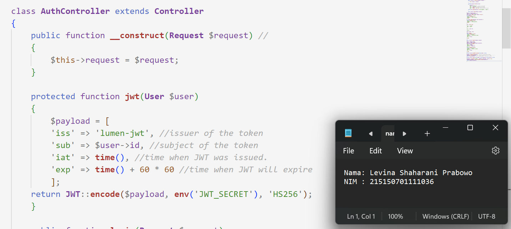

# Praktikum  9 : JSON Web Token (JWT)

Langkah-langkah dan hasil Screenshot praktikum  9 :  JSON Web Token (JWT)
* ## Penyesuaian Database
* ### Langkah 1
Melakukan perubahan pada length kolom token dengan menghapus parameter 72 di belakangnya 

* ### Langkah 2
Menjalankan perintah ph partisan migrate:refresh untuk memperbaharui migrasi dan menghapus data yang lama

* ### Langkah 3
Menjalankan aplikasi pada endpoint /auth/register

* ## JWT Manual
* ### Langkah 1
Menambahkan ketiga fungsi berikut pada AuthController.php

* ### Langkah 2
Melakukan perubahan pada fungsi login

* ### Langkah 3
Menambahkan keempat fungsi berikut pada Middleware/Authorization.php

* ### Langkah 4
Melakukan perubahan pada fungsi handle

* ### Langkah 5
Menjalankan aplikasi pada endpoint /auth/login

* ### Langkah 6
Menjalankan aplikasi pada endpoint /home dengan melampirkan nilai token yang didapat setelah login pada header

* ## JWT Library
* ### Langkah 1
Melakukan generate jwt key secara online menggunakan website Djecrety ― Django Secret Key Generator

* ### Langkah 2
Melakukan instalasi package jwt firebase

* ### Langkah 3
Menambahkan fungsi berikut pada file AuthController

* ### Langkah 4
Melakukan perubahan pada fungsi login

* ### Langkah 5
Membuat file JwtMiddleware.php

* ### Langkah 6
Mendaftarkan middleware yang telah dibuat pada bootstrap/app.php

* ### Langkah 7
Menambahkan baris berikut pada file web.php

* ### Langkah 8
Menjalankan aplikasi pada endpoint /auth/login

* ### Langkah 9
Menjalankan aplikasi pada endpoint /home

